  

  

 

  
  &nbsp;
  
  &nbsp;
  
  &nbsp;
  

---

## 🧑‍💻 Who I Am

- 🎓 Final-year CSE student, building real projects alongside coursework
- 💻 Skilled in **HTML, CSS, JavaScript & Python**
- 🤖 Currently exploring **Computer Vision** with OpenCV
- 🌱 Growing into full-stack development
- 🚀 Built real-world projects — including an e-commerce store, a redesigned AI product landing page, and a weather dashboard
- 📫 Open to **Full Stack / Frontend Developer roles**, internships & collaborations

 

---

## 🚀 Featured Projects

### 🥻 Saree Website — *Saree E-Commerce Store*

| Layer | Technology |
|---|---|
| Frontend | React, TypeScript |
| Styling | Tailwind CSS |
| Build Tool | Vite |
| Backend | Supabase |

A modern, responsive saree e-commerce website featuring a beautiful shopping experience with cart, wishlist, search, and full responsive design.

🌐 **Live →** [saree-website-eight.vercel.app](https://saree-website-eight.vercel.app/) &nbsp; \| &nbsp; 📂 **Code →** [github.com/Siddhi-verma-web/saree-website](https://github.com/Siddhi-verma-web/saree-website)

---

### 🤖 AI Nexus Redesign — *Automate Work. Turn Data Into Next Steps.*

| Layer | Technology |
|---|---|
| Structure | HTML |
| Styling | CSS |
| Interactivity | JavaScript |

Redesigned AI-themed product landing page — refreshed UI and structure over the original AI Nexus build.

🌐 **Live →** [siddhi-verma-web.github.io/AI-Nexus-Redesign](https://siddhi-verma-web.github.io/AI-Nexus-Redesign/) &nbsp; \| &nbsp; 📂 **Code →** [github.com/Siddhi-verma-web/AI-Nexus-Redesign](https://github.com/Siddhi-verma-web/AI-Nexus-Redesign)

---

### 🌐 Siddhi Portfolio Pro — *Personal Portfolio Website*

| Layer | Technology |
|---|---|
| Structure | HTML |
| Styling | CSS |
| Interactivity | JavaScript |

Upgraded personal portfolio website showcasing projects, skills, and experience.

🌐 **Live →** [siddhi-verma-web.github.io/Siddhi-Portfolio-Pro](https://siddhi-verma-web.github.io/Siddhi-Portfolio-Pro/) &nbsp; \| &nbsp; 📂 **Code →** [github.com/Siddhi-verma-web/Siddhi-Portfolio-Pro](https://github.com/Siddhi-verma-web/Siddhi-Portfolio-Pro)

---

### ⛅ Weather Dashboard

| Layer | Technology |
|---|---|
| Structure | HTML |
| Styling | CSS |
| Interactivity | JavaScript |

🌐 **Live →** [siddhi-verma-web.github.io/Weather-Dashboard](https://siddhi-verma-web.github.io/Weather-Dashboard/) &nbsp; \| &nbsp; 📂 **Code →** [github.com/Siddhi-verma-web/Weather-Dashboard](https://github.com/Siddhi-verma-web/Weather-Dashboard)

---

### 🔐 Smart Password Strength Checker

| Layer | Technology |
|---|---|
| Structure | HTML |
| Styling | CSS |
| Interactivity | JavaScript |

🌐 **Live →** [siddhi-verma-web.github.io/Password-Strength-Checker](https://siddhi-verma-web.github.io/Password-Strength-Checker/) &nbsp; \| &nbsp; 📂 **Code →** [github.com/Siddhi-verma-web/Password-Strength-Checker](https://github.com/Siddhi-verma-web/Password-Strength-Checker)

---

### 🍽️ Royal Tadka — *Fine Indian Dining Website*

| Layer | Technology |
|---|---|
| Structure | HTML |
| Styling | CSS |
| Interactivity | JavaScript |

🌐 **Live →** [siddhi-verma-web.github.io/Royal-Tadka-Website](https://siddhi-verma-web.github.io/Royal-Tadka-Website/) &nbsp; \| &nbsp; 📂 **Code →** [github.com/Siddhi-verma-web/Royal-Tadka-Website](https://github.com/Siddhi-verma-web/Royal-Tadka-Website)

---

### 👁️ OpenCV Image Processing

| Layer | Technology |
|---|---|
| Language | Python |
| Library | OpenCV |

A collection of OpenCV image processing implementations using Python.

📂 **Code →** [github.com/Siddhi-verma-web/OpenCV-image-processing](https://github.com/Siddhi-verma-web/OpenCV-image-processing)

---

## 🛠️ Tech Stack

### Languages

  

### Currently Exploring

  

### Dev Tools

  

---

## 📊 GitHub Stats

<table>
<tr>
<td align="center">

</td>
<td align="center">

</td>
<td align="center">

</td>
<td align="center">

</td>
</tr>
</table>

---

## 📈 Contribution Activity

  

---

## 🐍 Contributions Snake

  <picture>
    <source media="(prefers-color-scheme: dark)"
            srcset="https://raw.githubusercontent.com/Siddhi-verma-web/Siddhi-verma-web/output/github-snake-dark.svg" />
    <source media="(prefers-color-scheme: light)"
            srcset="https://raw.githubusercontent.com/Siddhi-verma-web/Siddhi-verma-web/output/github-snake.svg" />
    
  </picture>

---

## 🤝 Connect

  
  &nbsp;
  
  &nbsp;
  
  &nbsp;
  

 

